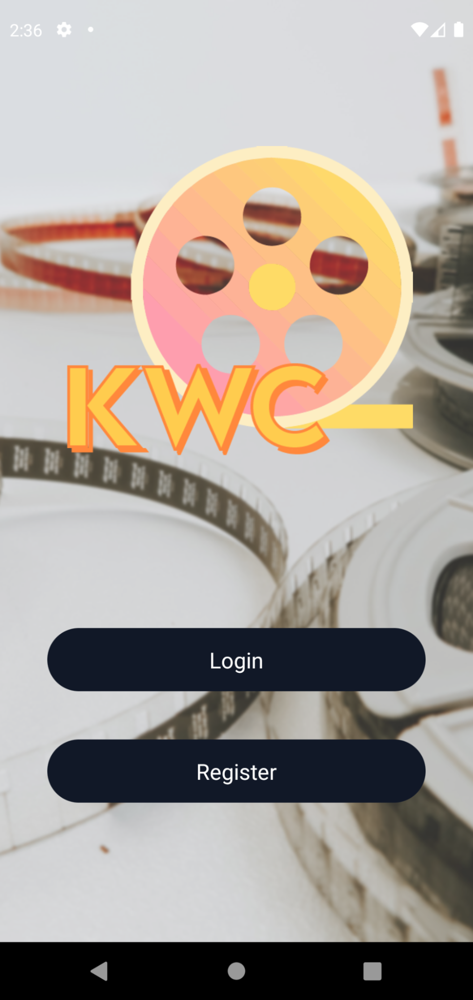
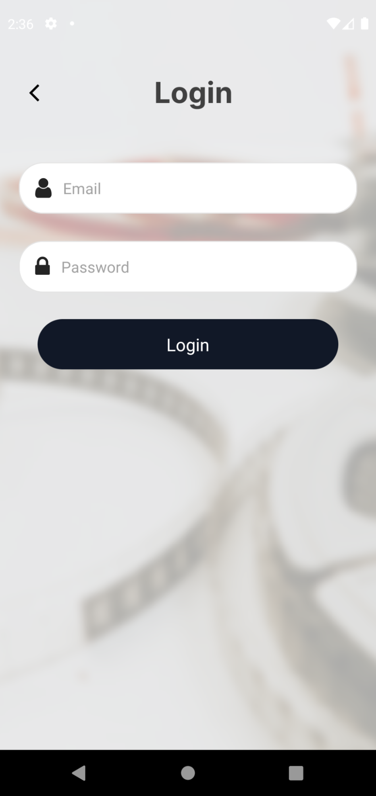
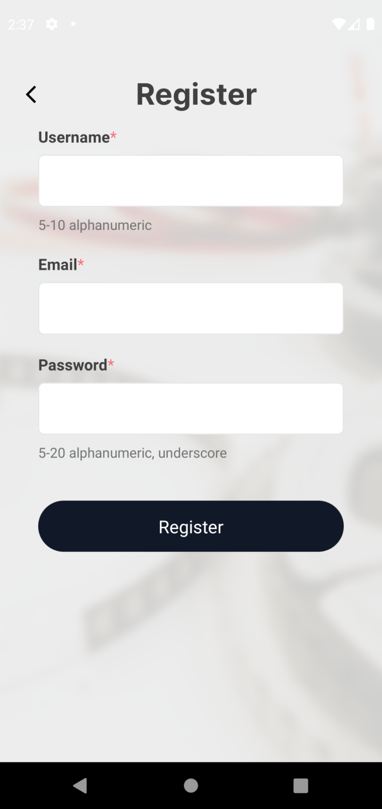
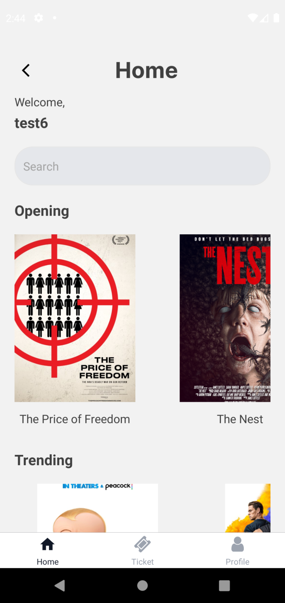
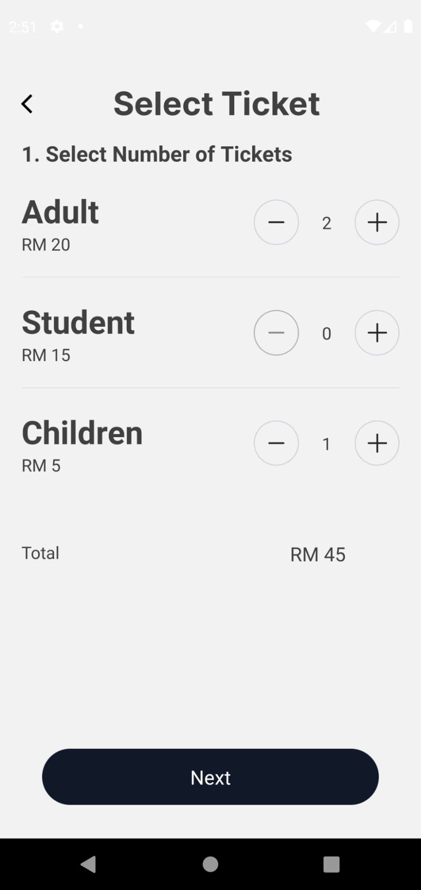
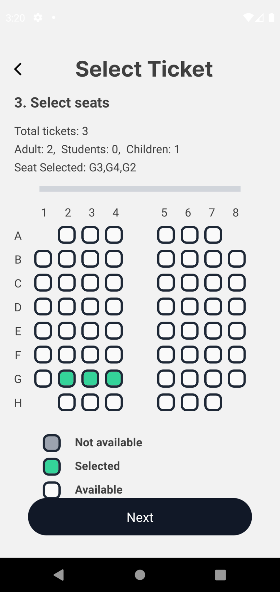
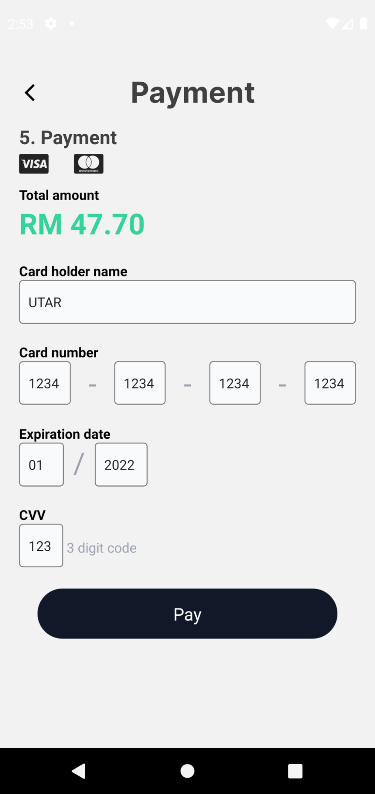
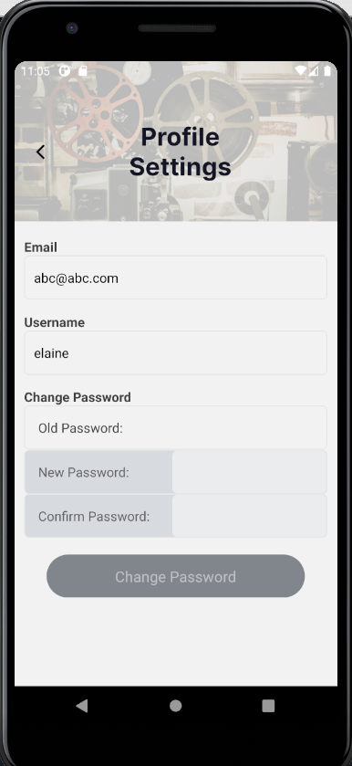

# Overview
A movie ticket selling app built using react native for learning purpose.

## Techstacj
### Frontend
- React native
- native base (UI)
- axios (network request)

### Backend
- express
- mongodb

## Features
- Login / Register Account
- View Movies
- Buy Movie Tickets (select movie, date & time, seats)
- profile

## Setup

Install mongoDB, then import the database into mongoDB

install mongoDB tools (https://fastdl.mongodb.org/tools/db/mongodb-database-tools-windows-x86_64-100.5.0.zip)
to import database
1. cd to mongodb bin
2. run command `./mongorestore -d WAD_app <directory_backup>`

to export
1. run command `./mongodump -d WAD_app -o <directory_backup>`

To run server,
1. cd to server
2. `npm install`
3. `npm run start`

To run app,
1. cd to app
2. `npm install`
3. `npx react-native run-android`

## Screenshots
       